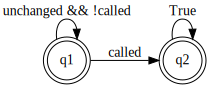

# 3. Debugging Smart Contracts with SmartACE

By Scott Wesley in collaboration Maria Christakis, Arie Gurfinkel, Xinwen Hu,
Jorge Navas, Richard Trefler, and Valentin Wüstholz.

Solidity supports pre- and post-conditions through the `require` and `assert`
statements. As shown in the [previous tutorial](2_getting_started.md), these are
sufficient for simple representation invariants. However, for more complex
properties, especially between two or more contracts, manual instrumentation
becomes difficult and error-prone.

In this tutorial, we show how smart contract invariants can be expressed in
temporal logic, converted into monitors, and then instrumented mechanically.
This instrumentation will be automated in future versions of SmartACE.

**Note**: This tutorial assumes all commands are run from within the
[SmartAce container](1_installation.md). All tutorial files are available within
the container from the home directory.

## Invariants Across Multiple Contracts

The following Solidity program gives a `Fund` contract which can `open()` and
`close()`. While open, users can `deposit()` Ether into the fund. The `Manager`
smart contract constructs a fund for which it is the owner. The fund should open
once `openFund()` is called on `Manager`.

```solidity
contract Fund {
    bool isOpen;
    address owner;

    constructor() public { owner = msg.sender; }

    function claim() public {
        owner = msg.sender;
    }

    function open() public {
        require(msg.sender == owner);
        isOpen = true;
    }

    function close() public {
        require(msg.sender == owner);
        isOpen = false;
    }

    function deposit() public payable { require(isOpen); }
}

contract Manager {
    Fund fund;

    constructor() public { fund = new Fund(); }

    function openFund() public { fund.open(); }
}
```

At first glance it may appear that the balance of fund will not change unless
`openFund()` is called. This is because calls to `open()` are checked against
the current owner. However, ownership exploits are an issue in
[real smart contracts](https://blog.openzeppelin.com/on-the-parity-wallet-multisig-hack/).
Let's use SmartACE to see if this invariant really holds.

## Encoding the Property

The first step in encoding our property is to state it precisely. Our logic of
choice is
[past linear temporal logic](http://fsl.cs.illinois.edu/index.php/Past_Time_Linear_Temporal_Logic)
(pLTL). We start with an informal statement
of the property.

> It is *always* the case that if `openFund()` is *not* called even *once*, then
> the balance of `Manager.fund` *prior to* and after the last transaction
> remains unchanged.

We can formalize this statement in the
[VerX Specification Language](https://verx.ch/docs/spec.html) for Ethereum smart
contracts. In this language, `FUNCTION` is the name of the last method called by
a client, while `prev(v)` is the value of `v` before `FUNCTION` was called.
`once` and `always` pLTL operators, where `once(p)` is true if `p` has ever been
true while `always(p)` is true if `p` has always been true. Using this language,
our property becomes:

```
always(
    !(once(FUNCTION == Manager.openFund()))
    ==>
    (BALANCE(Fund) == prev(BALANCE(Fund)))
)
```

To detect property violations, we convert the property into a monitor. For
brevity, we introduce the following predicates:

  * `called := (FUNCTION == Manager.openFund())`
  * `unchanged := (BALANCE(Fund) == prev(BALANCE(Fund)))`

The regular expression for the monitor is `(unchanged && !called)* called True*`.
The corresponding automaton is as follows:



The next two sections explain the details of the model, and then walk through
instrumenting the monitor. This procedure is currently manual, but will be
automated in a future release of SmartACE. The readers less interested in these
details can safely skip to the [final section](#debugging-the-contract).

### Understanding the Model

Before we instrument the SmartACE model, we take a detour to understand its
structure. Readers only interested in the monitor can
[skip ahead](#instrumenting-the-model). Otherwise, start by saving `fund.sol`
and then running:

```
solc fund.sol --bundle=Manager --c-model --output-dir=fund
```

This generates several artifacts:

  * `CMakeLists.txt`: generates build targets for fuzzing, symbolic execution,
    simulation, and model checking.
  * `cmodel.c`: provides the model we are verifying.
  * `harness.c`: provides the entry-point (`main`) to the model.
  * `primitives.h`: header-only library which defines C primitives for Solidity
    primitive types.
  * `libverify/`: runtime libraries which define how require, assert, etc., are
    handled in each model.

To understand the model, we will focus on `cmodel.c`. This file is unformatted,
but we can improve its presentation with `clang-format`:

  * `mdkir build ; cd build`
  * `CC=clang-10 CXX=clang++-10 cmake ..`
  * `cmake --build . --target run-clang-format`

We highlight four parts of the model: the contract encoding, the method
encoding, the bundle construction, and the "transaction loop". For those
interested in the model, but do not want to run the tools, the full generated
model is
[available here](https://github.com/ScottWe/smartace-examples/tree/master/tutorials/post-3/fund).
The line numbers below refer to that model. We start at line 8, with the
contract encoding.

```cpp
struct Fund {
    sol_address_t model_address;
    sol_uint256_t model_balance;
    sol_bool_t user_isOpen;
    sol_address_t user_owner;
};

struct Manager {
    sol_address_t model_address;
    sol_uint256_t model_balance;
    struct Fund user_fund;
};
```

A c-struct is generated for each contract. All Solidity primitive types are
wrapped by singleton c-struts in `primitives.h`. Members prefixed by `user_`
are taken from the smart contract definition, while members prefixed by `model_`
are generated by SmartACE. If a contract state variable is set exactly once,
through a call to `new`, the new contract is nested inside the calling contract.
To illustrate, if we defined a contract `struct Manager contract_0`, then the
balance of `fund` is `contract_0.user_fund.model_address`.

Between lines 19 to 84, we then find the encoding of each method. To avoid name
collisions, SmartACE renames each method according to the following rules:

  * The constructor of contract `Manager` maps to `Manager_Constructor`.
  * The fallback method of `Manager` maps to `Manager_Fallback`.
  * The method `openFund` of `Manager` maps to `Manager_Method_openFund`.

We then move on to the entry-point, `void run_model(void)`, at line 85. After
some setup code, we find at line 102 the initialization of `Manager`, and in
turn, `Manager.fund`.

```cpp
smartace_log("[Initializing contract_0 and children]");
sender.v = nd_range(3, 5, "sender");
value.v = 0;
blocknum.v = nd_increase(blocknum.v, 0, "blocknum");
timestamp.v = nd_increase(timestamp.v, 0, "timestamp");
Init_Manager(&contract_0, sender, value, blocknum, timestamp, paid, origin);
```

To summarize briefly, each method prefixed by `nd_` selects a value
non-deterministically. These values are used to model an arbitrary `msg.sender`,
and an increasing `block.number` and `block.timestamp`. The addresses `0`, `1`
and `2` are reserved for `address(0)`, `address(Manager)`, and
`address(Manager.fund)`, respectively. Hence, they are not valid senders.
However, an attentive reader may notice that we restrict `msg.sender` to `3` and
`4`. The importance of this choice, and its impact on correctness, are the topic
of the next tutorial. For now we can think of this as a bounded model with two
clients, so at the least, our verification gives valid counterexamples.

At line 108 we then find the "transaction loop" which simulates a sequence of
transitions:

```cpp
smartace_log("[Entering transaction loop]");
while (sol_continue()) {
    sol_on_transaction();
    /* ... Select non-deterministic blockchain state ... */
    uint8_t next_call = nd_range(0, 5, "next_call");
    switch (next_call) {
    case 0: {
        smartace_log("[Calling openFund on contract_0]");
        Manager_Method_openFund(&(contract_0), /* Blockchain state */);
        smartace_log("[Call successful]");
        break;
    }
    /* ... Other methods ... */
    }
}
```

The methods `sol_continue()` and `sol_on_transaction()` are runtime hooks
provided by `libverify/`. For `Seahorn`, `sol_continue()` is alway true while
`sol_on_transaction` is a no-op. This means that the loop runs forever. On each
iteration, a method is selected non-deterministically, and then executed with
non-deterministic arguments. The simulation ends if an assertion fails.

### Instrumenting the Model

In this section, we will walk through encoding the monitor using three ghost
variables and a single assertion. The end result is
[avialable here](https://github.com/ScottWe/smartace-examples/blob/master/tutorials/post-3/instrumented/cmodel.c).
We start by declaring each variable at the beginning of `cmodel.c`.

```cpp
GHOST_VAR int g_called_openFund;
GHOST_VAR sol_uint256_t g_pre_balance;
GHOST_VAR sol_uint256_t g_post_balance;
```

`g_called_openFund` tracks when `Fund.openFund()` is called.
`g_pre_Fund_balance` and `g_post_Fund_balance` store the values of
`BALANCE(FUND)` before and after each transaction.  Note that GHOST_VAR is a
placeholder for readability, and is ignored by the C compiler.

We return to `Manager_Method_openFund` on line 77, and set `g_called_openFund` on
entry. This is sufficient, as there is a single instance of `Manager`.

```cpp
void Manager_Method_openFund(struct Manager *self, /* Blockchain State */) {
    g_called_openFund = 1;
    Fund_Method_open(&self->user_fund, /* Blockchain State */);
}
```

We then return to the transaction loop at line 108. We capture the value of
`contract_1->model_balance` before and after each transaction. At the end of
each iteration, we assert that `unchanged` is true, or that `called` has been
observed at least once.

```cpp
smartace_log("[Entering transaction loop]");
while (sol_continue()) {
    sol_on_transaction();
    g_pre_balance = contract_1->model_balance;
    /* ... Select non-deterministic blockchain state ... */
    uint8_t next_call = nd_range(0, 5, "next_call");
    switch (next_call) {
    case 0: {
        smartace_log("[Calling openFund on contract_0]");
        Manager_Method_openFund(&(contract_0), /* Blockchain state */);
        smartace_log("[Call successful]");
        break;
    }
    /* ... Other methods ... */
    }
    g_post_balance = contract_1->model_balance;
    sol_assert(g_called_openFund || g_pre_balance.v == g_post_balance.v, "Failure.");
}
```

## Debugging the Contract

If we run `cmake --build . --target verify` on the instrumented contract, we
will see that the property does not hold. When `Seahorn` detects a violation, it
generates a counterexample. This counterexample resolves all non-determinism
with concrete values, and drives the program to an assertion failure.
Thankfully, `Seahorn` provides these counterexamples as LLVM programs. We can
link a counterexample against our executable model to produce a debuggable trace
(a *witness*).

In practice, we could analyze this trace using a debugger such as `gdb`.
However, in this example, it is sufficient to read a trace log from the witness.
Let's reconfigure our example with logging, and then build the witness:

  * `CC=clang-10 CXX=clang++-10 cmake .. -DSEA_EXELOG=true`
  * `cmake --build . --target witness`
  * `./witness`

This gives the trace:

```
[Constructing contract_0 and children]
sender [uint8]: 3
blocknum [uint256]: 0
timestamp [uint256]: 0
[Entering transaction loop]
sender [uint8]: 3
blocknum [uint256]: 0
timestamp [uint256]: 0
next_call [uint8]: 1
[Calling claim() on contract_1]
[Call successful]
sender [uint8]: 3
blocknum [uint256]: 0
timestamp [uint256]: 0
next_call [uint8]: 2
[Calling open() on contract_1]
[Call successful]
sender [uint8]: 3
blocknum [uint256]: 0
timestamp [uint256]: 0
next_call [uint8]: 4
[Calling deposit() on contract_1]
value [uint256]: 1
[Call successful]
[sea] __VERIFIER_error was executed
```

At first this counterexample might seem surprising. No client should be able to
call `open()` directly. However, this is precisely what happens. To figure out
why, we can log the owner of `contract_1` during each iteration of the
transaction loop. After making these changes we can rerun:

  * `cmake --build . --target witness`
  * `./witness`

To obtain the following trace:

```
[Constructing contract_0 and children]
sender [uint8]: 3
[Entering transaction loop]
=> owner of contract_1: 1
sender [uint8]: 3
next_call [uint8]: 1
[Calling claim() on contract_1]
[Call successful]
=> owner of contract_1: 3
sender [uint8]: 3
next_call [uint8]: 2
[Calling open() on contract_1]
[Call successful]
=> owner of contract_1: 3
sender [uint8]: 3
next_call [uint8]: 4
[Calling deposit() on contract_1]
value [uint256]: 1
[Call successful]
[sea] __VERIFIER_error was executed
```

We can now see how this is possible. When `Manager` is constructed, it creates a
new fund, whose owner is `Manager`. This aligns with the first owner. Client 3
then `claim()` and takes ownership. This aligns with the second owner. From
here, client 3 is free to `open()` the contract, and then `deposit()` a single
Ether. The balance of `Fund` has changed without a call to `openFund()`. This
suggests that all ownership transfers should be approved by the current owner.
One solution is to remove `claim()` and replace it with an owner-only transfer
method.

## Conclusion

In this tutorial, we learned how to instrument SmartACE models using pLTL
specifications. We then saw how this technique could be used to find non-trivial
vulnerabilities in a bounded model of the system. Finally, we learned how to use
executable counterexamples to debug these vulnerabilities. In the next tutorial
we will extend these techniques to unbounded models.
