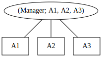
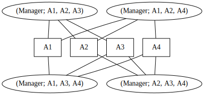

# 5. Reasoning About Client State in SmartACE

By Scott Wesley in collaboration Maria Christakis, Arie Gurfinkel, Xinwen Hu,
Jorge Navas, Richard Trefler, and Valentin Wüstholz.

[Last time](4_arbitrary_clients.md), we used SmartACE to prove safety properties
for any number of clients. The example was by no means trivial, but it was in
many ways a toy. Namely, the `Manager` bundle we analyzed did not keep mappings
from client addresses to client data. In such cases we must summarize both the
client addresses and the client data.

In this tutorial, we prove a simple invariant with client data. First, we extend
the `Manager` bundle to use maps, and describe our property of interest. We then
revisit network topology to better understand the impact of client data. Using
this insight, we then work on summarizing the client data. Finally, we show how
SmartACE applies this theory in practice, and then use it to verify our new
property.

**Note**: This tutorial assumes all commands are run from within the
[SmartAce container](1_installation.md). All tutorial files are available within
the container from the home directory.

## Extending Our Running Example

We start by returning to the `Manager` bundle. To briefly recap, the `Manager`
bundle consists of two smart contracts: a `Fund` contract into which clients
`deposit()` Ether, and a `Manager` which owns and controls access to the `Fund`.
In the past two tutorials we
[identified an ownership exploit](3_transactions.md), patched the bug, and then
[verified its absence for any number of clients](4_arbitrary_clients.md).

Let's extend the `Manager` bundle to make use of mappings. To keep our example
realistic, we mimic [ERC-20 tokens](https://eips.ethereum.org/EIPS/eip-20).
First we add an `invested` mapping onto `Fund` to track the total deposits of
each client. Next, we add a `transfer()` method to allow a client to transfer
`_amount` Ether to `_destination`. The new contract is given below:

```solidity
contract Fund {
    bool isOpen;
    address owner;

    mapping(address => uint) invested;

    constructor() public { owner = msg.sender; }

    // Access controls.
    modifier ownerOnly() { require(owner == msg.sender); _; }
    function releaseTo(address _new) public ownerOnly { owner = _new; }
    function open() public ownerOnly { isOpen = true; }
    function close() public ownerOnly { isOpen = false; }

    // Invest money into fund.
    function deposit() public payable {
        require(isOpen);
        invested[msg.sender] += msg.value;
    }

    // Move money between accounts.
    function transfer(address _destination, uint _amount) public {
        require(_amount > 0);
        require(invested[_destination] + _amount > invested[_destination]);
        require(invested[msg.sender] >= _amount);

        invested[msg.sender] -= _amount;
        invested[_destination] += _amount;
    }
}

contract Manager {
    Fund fund;

    constructor() public { fund = new Fund(); }

    function openFund() public { fund.open(); }
}
```

We can now pose local client properties about the bundle. These are properties
which give invariants over fixed size subsets of clients. For example, we could
specify that the investments of any two clients are conserved across calls to
`transfer()`. This property serves as our running example for the remainder of
the tutorial. We specify the property in past linear temporal logic (pLTL) by
writing:

> It is *always* the case that whenever `msg.sender` calls `transfer()` and
> sends `_amount` to some other client, `_destination`, then
> `invested[msg.sender]` is > decreased by  `_amount` while 
> `invested[_destination]` is increased by `_amount`.

We then formalize the property using the
[VerX Specification Language](https://verx.ch/docs/spec.html), as presented in
[tutorial 3](3_transactions.md). Recall that `FUNCTION` is the name of the last
method called, while `prev(v)` is the value of `v` before `FUNCTION` was called.
`once` and `always` are pLTL operators, where `once(p)` is true if `p` has ever
been true while `always(p)` is true if `p` has always been true. In addition to
these notations, the language also defines `Fund.transfer(address, uint256)[i]`
to refer to the i-th argument passed to `Fund.transfer(address, uint256)`. This
gives the formalization:

```
always(
    (
        (FUNCTION == Fund.transfer)
        &&
        (msg.sender != Fund.transfer(address,uint256)[0])
    )
    ==>
    (
      (Fund.invested[msg.sender]
            + Fund.transfer(address,uint256)[1]
            == prev(Fund.invested[msg.sender]))
        &&
        (Fund.invested[Fund.transfer(address,uint256)[0]]
            - Fund.transfer(address,uint256)[1]
            == prev(Fund.invested[msg.sender]))
    )
)
```

As a final step, we can construct a monitor for the property. The monitor
detects if the property is violated, and allows us to verify the claim. Our
property is essentially a functional post-condition, so the monitor is very
compact. First we introduce the following predicates:

  * `is_transfer := FUNCTION == Fund.transfer`
  * `distinct := msg.sender != _destination`
  * `sent := invested[msg.sender] + _amount = prev(invested[msg.sender])`
  * `recv := prev(invested[_destination]) + _amount = invested[_destination]`

Expressed as a regular expression, the monitor is:
`(!(is_transfer && distinct) || (send && recv))*`.

## Local Reasoning Over Client Mappings

Mappings allow us to associate variables with clients. We can conceptualize
these associations as a
[bipartite graph](https://mathworld.wolfram.com/BipartiteGraph.html) with two
types of vertices: *process vertices* and *data vertices* [[3](#reference)].
Each process vertex is associated with one or more transactions of the `Manager`
bundle, whereas each data vertex is assigned to a single mapping entry. If a
process can write to a mapping entry, there is a directed edge from the process
vertex to a data vertex. Likewise, if a process can read from a mapping vertex,
there is a directed edge from te data vertex to the process vertex. We call this
graph the *network topology* of the `Manager` bundle [[3](#reference)].

This leads us to the general case of local reasoning. We have a network which is
parameterized by the number of processes. Each process has access to some finite
set of shared variables. We want to show that all processes accessing the same
variable obey some locally inductive invariant. We then combine these invariants
to obtain an invariant for the entire network [[3](#reference)]. We can think of
the [previous tutorial](4_arbitrary_clients.md) as the degenerate case where
each client has zero mapping entries.

### Topology in the `Manager` Bundle

First we need to characterize the `Manager` bundle topology. We start this by
looking at a given *instance* of the bundle. That is, the topology of the bundle
for a fixed number of clients. We will see that the topology exhibits symmetries
which generalize to any number of clients.

To begin, let's fix the number of clients and consider an arbitrary instance. We
saw in the [previous tutorial](4_arbitrary_clients.md) that each transaction can
touch at most 6 clients at once. Three of these clients are fixed, namely
`address(0)`, `address(Fund)`, and `address(Manager)`. If we fix the final three
clients, we obtain a subset of the possible transactions. If we enumerate all
client choices, we enumerate all possible transactions.

We can use this intuition to assign transitions to processes. First we select
one such subset of clients. We then take the transactions whose addresses are
restricted to these clients. To make this idea more concrete, we can imagine
writing a new contract in which we apply the following modifier to all input
addresses:

```solidity
modifier restrictClients(address _client) {
    require(
        _client == address(0) || _client == address(Manager) ||
        _client == address(Fund) || _client == addr1 ||
        _client == addr2 || _client == addr3
    );
}
```

After restricting the clients, we then assign the transactions to a unique
process vertex. From this vertex, we add edges to the data vertices of each
client. If we repeat this process for each subset of clients, we assign every
transaction to some process vertex in the network topology.

To illustrate this construction, and to highlight its symmetry, we give the
graphs for 6 and 7 clients. To improve readability, we do not show the data
vertices shared by all processes. We name the arbitrary addresses `A1`, `A2`,
`A3`, and `A4` to stress the point that each address is strictly an identifier.
We write `(Manager, i, j, k)` to denote the transactions of the `Manager` bundle
associated with addresses `i`, `j` and `k`. All edges are bi-directional.

The topology for 6 clients is:



The topology for 7 clients is:



### Compositional Invariants in the `Manager` Bundle

Local reasoning allows us to find a sufficiently large neighbourhood, against
which we can then prove properties for all possible networks. We do this in two
steps. First, we no longer think of each data vertex as belonging to a single
client. Instead, we now let it represent a group of similar clients (formally,
this is an *equivalence class*). We then replace each data vertex with a locally
inductive invariant which summarizes all possible values at the vertex. We call
this a compositional invariant.

This invariant can be any predicate over the state of the neighbourhood.
Specifically, it can be aware of the client class it is summarizing. However, to
be compositional, it must also satisfy three properties [[2](#reference),
[3](#reference)]:

  1. (Initialization) When the neighbourhood is zero-initialized, the data
     vertices satisfy the invariant.
  2. (Local Inductiveness) If the invariant holds for some clients before they
     perform a transaction, the invariant still holds afterwards.
  3. (Non-interference) If the invariant holds for some client, the actions of
     any other clients cannot break it.

In other words, the compositional invariant holds initially, and is never
violated by any clients. This ensures that the values written into data
vertices are never "forgotten". Using this intuition, it is not hard to see why
local reasoning with a compositional invariant is guaranteed to cover all paths
of execution.

While compositionality ensures that our model preserves counterexamples, it does
not necessarily ensure that we preserve the correctness of the bundle. If our
summary is too weak, it might permit counterexamples which do not exist in the
original bundle. We say that a compositional invariant is *adequate* if it
blocks all such counterexamples [[3](#reference)].

We can use the insight of compositional invariants to better justify our
restricted address values in the [previous tutorial](4_arbitrary_clients.md). As
each address is really a summary of one or more clients, the address values are
no longer meaningful. Instead, what matters are the relationships satisfied by
two or more addresses. We used the program syntax to identify that only equality
mattered, and then we constructed a set of address values which could satisfy
this relation (formally, we created an *abstract domain* of addresses). We then
ensured adequacy by blocking trivial counterexamples (i.e., contract addresses
are distinct from client addresses).

### Local Reasoning in SmartACE

When we apply local reasoning in SmartACE, we partition the addresses into
*distinguished* addresses and *representative* addresses. Distinguished
addresses are used when the address must refer to a single client, such as a
literal address or a contract address. Representative addresses are used when
the address does not refer to a distinct client. This distinction is important,
as at any point during analysis, we know the exact value of each distinguished
vertex.

Under this perspective, local reasoning requires three parameters: the number of
distinguished addresses, the number of representative addresses, and a predicate
over neighbourhoods. SmartACE automatically discovers cutoffs for the number of
distinguished addresses and representative addresses, using the techniques
outlined in the [previous tutorial](4_arbitrary_clients.md). However, the
predicate must be provided manually. At the present, SmartACE will attempt to
strengthen the predicate into an adequate compositional invariant. In the
future, SmartACE will also automate the selection of predicates.

As an example, let's see how SmartACE strengthens a candidate predicate. For
simplicity, we select the weakest candidate, namely `True`. It is not hard to
see that `True` is compositional by definition, However, it may not be adequate
for our property of interest. To check whether the predicate is adequate, we
instrument the mappings in our model. We walk through this procedure in the next
two sections. In the [first section](#mappings-in-smartace), we take a detour
and outline how maps are modelled in SmartACE. In the
[second section](#instrumenting-the-adequacy-check), we use this knowledge to
instrument the adequacy checks. With these goals in mind, let's start by
generating the model:

  * `solc fund.sol --bundle=Manager --c-model --output-dir=fund`
  * `cd fund ; mkdir build ; cd build`
  * `CC=clang-10 CXX=clang++-10 cmake ..`
  * `cmake --build . --target run-clang-format`

#### Mappings in SmartACE

Open `cmodel.c`. At line 8 we can find the mapping itself.

```cpp
struct Map_1 {
  sol_uint256_t data_0;
  sol_uint256_t data_1;
  /* ... Other entries ... */
  sol_uint256_t data_5;
};
```

We observe that the mapping stores a single entry for each restricted address
value. The intention is that during transactions, the `data_` variables form a
snapshot of some neighbourhood within the network. As addresses `0` to `2` are
distinguished, these entries are shared between all possible neighbourhoods. For
addresses `3` to `5`, however, the entries are representative and need not
persist across neighbourhoods. This insight is important once we instrument the
model.

Moving to lines 147 to 181, we find the operations defined on the mapping.

```cpp
sol_uint256_t Read_Map_1(struct Map_1 *arr, sol_address_t key_0) {
  if (5 == key_0.v)
  {
    return arr->data_5;
  }
  /* ... Other cases ... */
  else if (0 == key_0.v)
  {
    return arr->data_0;
  }
  /* ... Unreachable error case ... */
}

void Write_Map_1(struct Map_1 *arr, sol_address_t key_0, sol_uint256_t dat) {
  if (5 == key_0.v)
  {
    arr->data_5 = dat;
  }
  /* ... Other cases ... */
  else if (0 == key_0.v)
  {
    arr->data_0 = dat;
  }
}
```

By wrapping mapping accesses in function calls, SmartACE can easily instrument
all mapping accesses. We will see in a future tutorial how the instrumentation
of the write method allows us to reason locally about sums across mappings.

#### Instrumenting the Adequacy Check

Now that we understand how SmartACE models a mapping, we are ready to instrument
the adequacy check. There are two parts to the adequacy check:

  1. We must instrument the property, just as we have done in
     [previous tutorials](3_transactions.md).
  2. Before each transaction, we must place new values in each representative
     entry of `invested`.

If we were to stop after step one, we would be left with a bounded model, just
as we had constructed in [tutorial 3](3_transactions.md). To generalize this to
an arbitrary number of clients, we must begin each transaction with new values
at each representative vertex. Intuitively, we can think of this as allowing a
new client from the same client group to make a move. Let's see how this looks
in practice.

In general, we must instrument the property against any arbitrary clients. We
will see an example of this in the next tutorial. However, for our simple
property, the clients are not arbitrary. They are bounded to the sender and
recipient of each `transfer()` call. Given this insight, we first add global
ghost variables to track the pre- and post-investments of both clients:

```cpp
GHOST_VAR sol_uint256_t recipient_pre;
GHOST_VAR sol_uint256_t recipient_post;
GHOST_VAR sol_uint256_t sender_pre;
GHOST_VAR sol_uint256_t sender_post;
```

We then instrument the check in `transfer()` at line 105:

```cpp
void Fund_Method_transfer(/* Blockchain state */,
                          sol_address_t func_user___destination,
                          sol_uint256_t func_user___amount) {
  sol_uint256_t dest_bal = Read_Map_1(&self->user_invested, func_user___destination);
  sol_uint256_t sender_bal = Read_Map_1(&self->user_invested, sender);

  /* [START] INSTRUMENTATION */
  recipient_pre = dest_bal;
  sender_pre = sender_bal;
  /* [ END ] INSTRUMENTATION */

  sol_require(func_user___amount.v > 0, 0);
  sol_require(dest_bal.v + func_user___amount.v > dest_bal.v, "Require failed.");
  sol_require(sender_bal.v >= func_user___amount.v, "Require failed.");

  Write_Map_1(&self->user_invested, sender,
              Init_sol_uint256_t(sender_bal.v - func_user___amount.v));
  Write_Map_1(&self->user_invested, func_user___destination,
              Init_sol_uint256_t(dest_bal.v + unc_user___amount.v));

  /* [START] INSTRUMENTATION */
  sender_post = Read_Map_1(&self->user_invested, sender);
  recipient_post = Read_Map_1(&self->user_invested, func_user___destination);
  if (sender.v != func_user___destination.v)
  {
    sol_assert(sender_pre.v == sender_post.v + func_user___amount.v, "Failure.");
    sol_assert(recipient_post.v == recipient_pre.v + func_user___amount.v, "Failure.");
  }
  /* [ END ] INSTRUMENTATION */
}
```

Next we instrument the transaction loop. At the start of each transaction, we
select a process to run the transaction. Since the processes in our network
model are conceptual, this equates to initializing a new neighbourhood. We know
that distinguished clients are shared between all neighbourhoods, so this
reduces to selecting new values for all representative vertices. We make this
selection in accordance with the candidate predicate.

First, let's make the encode the predicate in the model. By definition, the
predicate over process configurations. Therefore, we add the following
definition to `cmodel.c`:

```cpp
// The `True` compositional invariant.
int invariant(struct Manager *c0, struct Fund *c1)
{
  // We ignore the process state...
  (void) c0; (void) c1;
  // ... and always return true.
  return 1;
}
```

Now let's populate the representative vertices. We will do this before running
the transaction. Navigate to line 240 and add the following:

```cpp
/* [START] INSTRUMENTATION */
// Updates the representative vertices.
Write_Map_1(&contract_1->user_investments,
            Init_sol_address_t(3),
            Init_sol_uint256_t(nd_uint256_t("investments[3]")));
Write_Map_1(&contract_1->user_investments,
            Init_sol_address_t(4),
            Init_sol_uint256_t(nd_uint256_t("investments[4]")));
Write_Map_1(&contract_1->user_investments,
            Init_sol_address_t(5),
            Init_sol_uint256_t(nd_uint256_t("investments[5]")));
/* [ END ] INSTRUMENTATION */

/* [START] INSTRUMENTATION */
// Assumes that the predicate holds.
sol_require(invariant(&contract_0, contract_1), "Bad arrangement.");
/* [ END ] INSTRUMENTATION */

switch (next_call) { /* ... Cases and check ... */ }

// The predicate is `True`, so it trivially hold afterwards.
```

This new model replaces entries 3, 4 and 5 with the candidate predicate. If this
new program is safe, then the predicate must be adequate. Combined with our prior
knowledge that `True` is compositional, this program is safe only if `True` is
an adequate compositional invariant. In the next tutorial, we will look at cases
where the predicate it not trivially compositional.

## Proving the Property

Now let's see if the bundle meets its specifications. As before, run:

```
cmake --build . --target verify
```

We find that no counterexample exists. However, we are not given a proof
certificate. At first this may seem like an error, but it is in fact correct. 
If no certificate is given, then additional invariants are not necessary to
prove the property. If we look at how we instrumented the property, this isn't
surprising. Essentially, our property summarizes the operations of `transfer()`,
and thus follows trivially.

### A Remark on Correctness and Modal Logic

At the start of this tutorial we required that our property should hold whenever
the recipient of `transfer()` is distinct from the sender. By doing this, we
sidestepped some nuances of the specification. Namely, we avoided defining what
it means for `transfer()` to conserve Ether. In the case of a distinct sender
and recipient, the sender's investment should decrease by `_amount` while the
recipient's investment should increase by `_amount`. However, when the sender
and recipient are the same, this requires that the sender's investment both
increase and decrease by `_amount`. This is impossible unless `_amount == 0`.

Instead, we would like to require that whenever the sender is the recipient, the
sender's investment is unchanged. While we could have specified this, it would
have been very verbose. In practice, we would like to assign sets of properties
to states of the smart contract. We would also like to identify when certain
states are missed by the specifications, such as `msg.sender == _destination` in
our example. One promising solution to this problem is modal logic, which can
extend pLTL to succinctly and explicitly describe the *modes* (states) of a
system [[1](#references)].

## Conclusion

In this tutorial, we learned how SmartACE models bundles with client-owned data.
We were introduced to compositional invariants and adequacy checks. Using these
techniques, we verified a property over all pairs of mapping entires against a
trivial compositional invariant. In the next tutorial, we will look at verifying
more difficult properties against non-trivial compositional invariants.

## References

  1. Champion, A., Gurfinkel, A., Kahsai, T., Tinelli, C.: A mode-aware contract
     language for reactive systems. SEFM. **14**. 347-366 (2016). DOI:
     https://doi.org/10.1007/978-3-319-41591-8

  2. Gurfinkel, A., Meshman, Y., Shoham, S.: SMT-based verification of
     parameterized systems. FSE. **24**, 338-348 (2016). DOI:
     https://doi.org/10.1145/2950290.2950330

  3. Namjoshi, K.S., and Trefler, R.J.: Parameterized compositional model
     checking. TACAS. **22**, 589-606 (2016). DOI:
     https://doi.org/10.1007/978-3-662-49674-9_39
